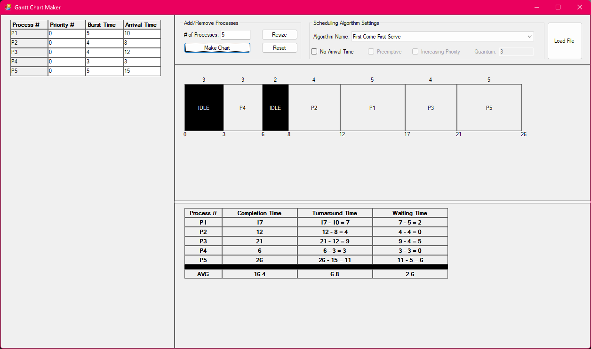
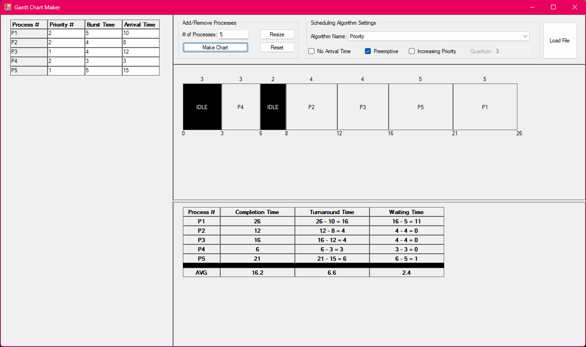
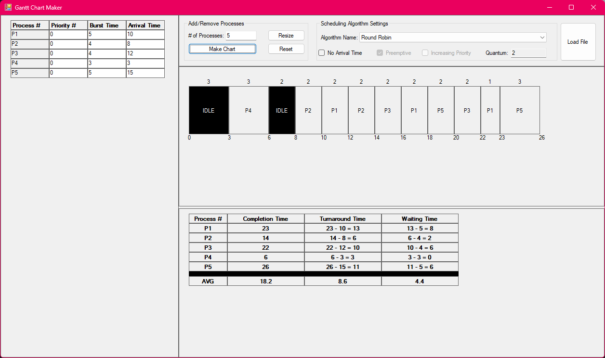

# Gantt Chart Maker

**Gantt Chart Maker** is a Windows Forms application designed to automate the creation of Gantt charts for CPU scheduling algorithms. It provides an interactive platform to simulate scheduling strategies, validate results, and analyze performance metrics.

## Background

This application was inspired from what I had learned in my Operating Systems course and aimed to deepen understanding of CPU scheduling algorithms and enhance skills in dynamic UI development. It serves as a tool to automate and validate results, offering execution time summaries and performance comparisons across various scheduling methods.

## Features

- **Dynamic UI**: Built using standard Windows Form libraries to deliver an interactive and user-friendly interface.
- **Support for Arrival Times**: Simulate processes with different arrival times.
- **Preemptive Scheduling Modes**: Analyze scheduling algorithms with preemptive capabilities.
- **Customizable Quantum Settings**: Flexibly set time slices for Round-Robin scheduling.
- **Performance Analysis**: Generate execution time summaries and compare the efficiency of different algorithms.

## Supported Scheduling Algorithms

- First-Come, First-Served (FCFS)
- Shortest Job Next (SJN)
- Round-Robin (RR)
- Priority Scheduling
- Preemptive and Non-Preemptive Modes

## Installation

To use **GanttChartMaker**, follow these steps:

1. Clone the repository:
   ```bash
   git clone https://github.com/fsoto-GH/GanttChartMaker.git
   ```
2. Open the solution file in Visual Studio.
3. Build the project to restore dependencies.
4. Run the application using Visual Studio or publish it as an executable.

## Usage

1. Launch the application.
2. Input process details such as arrival times, burst times, and priorities.
3. Select the desired scheduling algorithm and configure settings (e.g., quantum for Round-Robin, # of processes).
4. Click "Make Chart" to generate the Gantt chart and view performance metrics.

## Screenshots






## Future Enhancements

- Add support for additional scheduling algorithms (e.g., Multilevel Queue).
- Export Gantt charts and performance summaries to external files.
- Improve visual customization of the Gantt chart (e.g., color-coding for processes).
- Support for more complex scenarios (e.g., I/O-bound processes).

## License

This project is licensed under the [MIT License](LICENSE).
